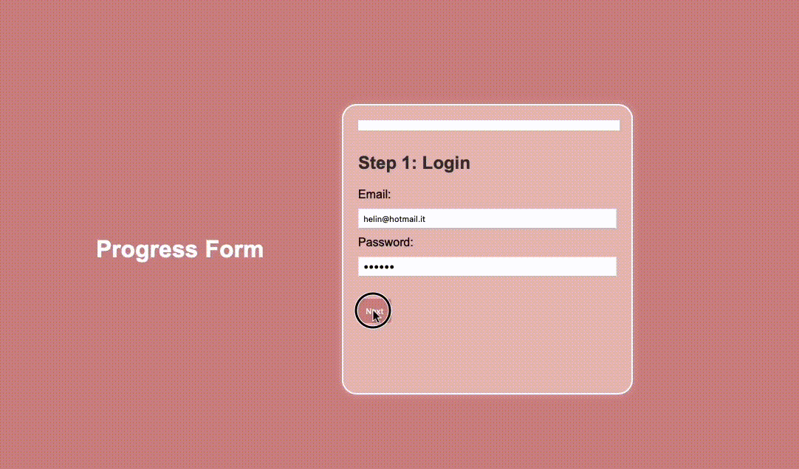

# Projects

Here you will find various projects

## Current Projects:

1. Expanding cards:
   

2. Step Form:
   

## Table of contents

- [Installation](#installation)
- [Usage](#usage)
- [Configuration](#configuration)
- [Project Structure](#project-structure)
- [Contributing](#contributing)
- [License](#license)
- [Contact](#contact)

## Installation

To install and run this project, follow these steps:

1. **Clone the repository:**

   ```bash
   git clone https://github.com/helinlazz/Projects.git
   ```

   2. **Navigate to the project directory:**

   ```bash
   cd projects
   ```

2. **Install dependencies:**

   ```bash
   npm install
   ```

## Usage

Start the application:

```bash
npm run dev
```

## Project Structure

projects/
|-- 01. Expanding cards/
|-- 02. Step Form/
|-- gif/
|-- README.md

## Contact

_Author_: Mirka Medaglini
_Email_: mirkamedaglini@hotmail.it
